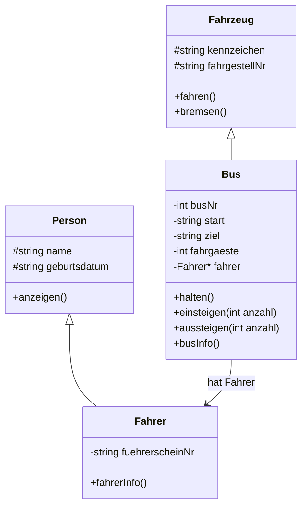

```mermaid
classDiagram

class Person {
    #string name
    #string geburtsdatum
    +anzeigen()
}

class Fahrer {
    -string fuehrerscheinNr
    +fahrerInfo()
}

class Fahrzeug {
    #string kennzeichen
    #string fahrgestellNr
    +fahren()
    +bremsen()
}

class Bus {
    -int busNr
    -string start
    -string ziel
    -int fahrgaeste
    -Fahrer* fahrer
    +halten()
    +einsteigen(int anzahl)
    +aussteigen(int anzahl)
    +busInfo()
}

Person <|-- Fahrer
Fahrzeug <|-- Bus
Bus --> Fahrer : hat Fahrer
```
